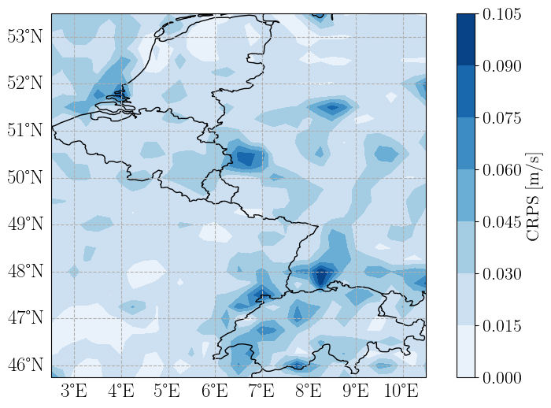

# Self-attentive transformer for postprocessing ensemble weather forecasts
This is the code corresponding to the paper https://arxiv.org/abs/2412.13957. The transformer described here is based on the original transformer by Finn (2021) and some parts of the code by Ashkboos et al. (2022).  The transformer presented here is designed for the fast and accurate postprocessing of ensemble weather forecasts, while allowing for a flexible inclusion of predictors and lead times. The self-attention mechanism allows for information exchange across predictor, spatial, temporal and ensemble dimension. The transformer is trained on the EUPPBenchmark dataset of Demaeyer et al. (2023) and
as a competitive benchmark, we used the classical MBM method of Van Schaeybroeck & Vannitsem (2015). 



_CRPS improvement made over the EUPPBench area when postprocessing 10m wind speed_


If you use this repository please cite:
_Van Poecke, A., Finn, T. S., Meng, R., Bergh, J. V. D., Smet, G., Demaeyer, J., ... & Hellinckx, P. (2024). Self-attentive Transformer for Fast and Accurate Postprocessing of Temperature and Wind Speed Forecasts. arXiv preprint arXiv:2412.13957._
### Structure
The scripts here work with relative directories. 
```
PP_EUPP/
├── ClassicalMBM
│   └── trainMBM.py  #Script to train the classical MBM methods 
├── data #training data should be downloaded here 
│   └── Download_EUPPBench.py  #Script to download the EUPPBench data. 
├── LICENSE
├── Loader.py #data loader script, extracts data and prepares it for training
├── __pycache__
│   ├── Loader.cpython-310.pyc
│   └── Transformer.cpython-310.pyc
├── README.md
├── Train.py #script that executed the training. 
├── TrainValTestSplit #scripts used to split the data into training, validation and testing sets. 
│   ├── splitdates.py
│   ├── test_era5_files.pkl
│   ├── test_eupp_files.pkl
│   ├── train_era5_files.pkl
│   ├── train_eupp_files.pkl
│   ├── val_era5_files.pkl
│   └── val_eupp_files.pkl
├── Transformer.py #The actual transformer. For more details on this architecture, check the paper. 
└── utils
    ├── __init__.py
    ├── metrics.py #CPRS and truncated CRPS are defiend here. 
    ├── parser.py
    └── __pycache__
        ├── __init__.cpython-310.pyc
        ├── metrics.cpython-310.pyc
        └── parser.cpython-310.pyc
```

You can specify most parameters in the command line, e.g. an example training command would be; 


#### References
 * https://arxiv.org/abs/2106.13924
 * https://proceedings.neurips.cc/paper_files/paper/2022/hash/89e44582fd28ddfea1ea4dcb0ebbf4b0-Abstract-Datasets_and_Benchmarks.html.
 * https://essd.copernicus.org/articles/15/2635/2023/essd-15-2635-2023.html
 * https://rmets.onlinelibrary.wiley.com/doi/full/10.1002/qj.2397
